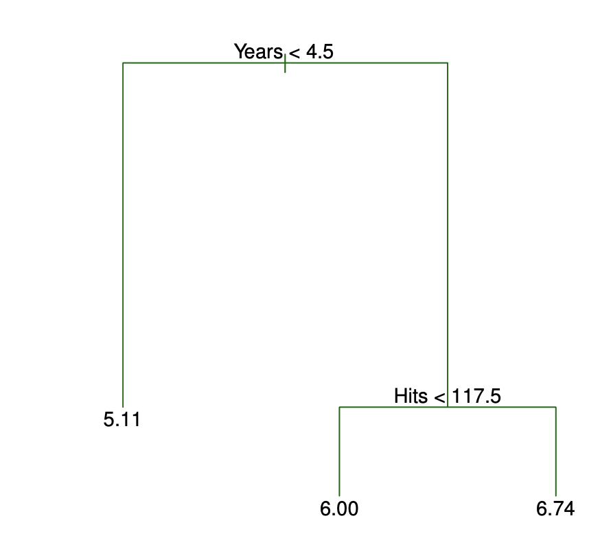
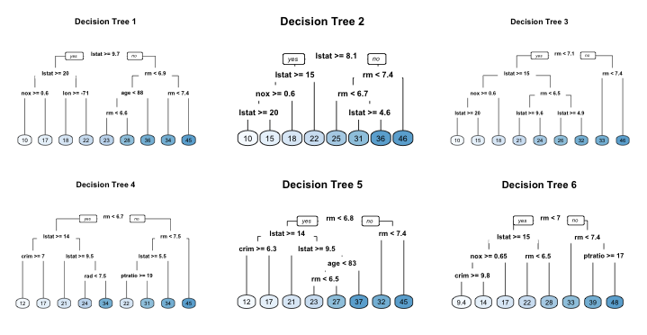

## Setting up

Options and settings

```{r setup, include=FALSE}
#knitr::opts_chunk$set(echo = TRUE, warning = FALSE)
```

Libraries

```{r}
library(tidyverse)      # for plotting and wrangling
library(tidymodels)     # for modeling
library(usemodels)      # for boilerplate functions
library(ISLR2)          # for data
library(rpart)          # don't need to load - tree
library(ranger)         # don't need to load - rf
library(rpart.plot)     # for plotting tree
library(patchwork)      # for composing plots
library(vip)            # for variable importance plots

tidymodels_prefer(quiet = TRUE)
theme_set(theme_minimal())
```

Data

```{r}
# I used it from MASS since that's what was done in the lab.
data("Boston", package = "MASS")

Boston <- as_tibble(Boston)
```


## Decision trees

Decision trees are a set of if-else rules that split the predictions into regions. Let's look at Figure 8.1 from ISLR based on the baseball data. The first split sends players with less than 4.5 years of experience to the left branch and those with more to the right. The node where the person ends is there predicted value - the average value of the response variable for that node (or the proportion of the category of interest for classification).



Decision tree goals: create a (potentially very long) list of if-else rules that bin observations together such that 

1. Observations within each node are similar.

2. Nodes are different from one another.  

Do this by finding the split that minimizes the sum of the squared residuals.

Define

$$
R_1(j,s) = \{X | X_j < s\} \ \  \text{and} \ \  R_2(j,s) = \{X | X_j \ge s\}.
$$

We want to find $X_j$ (the variable) and $s$ (the value of that varible) that minimize

$$
SSE = \sum_{i: x_i \in R_1(j,s)}(y_i - \bar{y}_{R_1})^2 + \sum_{i: x_i \in R_2(j,s)}(y_i - \bar{y}_{R_2})^2.
$$

After the initial split is found, this splitting process would keep going until a reasonable stopping criteria is reached. 

## Decision tree example - Boston housing

Let's look at an example using the Boston dataset. 

I like to start with the data splitting. First, a training and testing sets.

```{r}
set.seed(1234)
Boston_split <- initial_split(Boston)

Boston_train <- training(Boston_split)
Boston_test <- testing(Boston_split)
```


First, let's use the parsnip add-in to help us write the specification code below (I have modified it).

```{r}
reg_tree_spec <-
  decision_tree(
    # tree_depth = tune(), 
    # min_n = tune(), 
    # cost_complexity = tune()
    ) %>%
  set_engine('rpart') %>%
  set_mode('regression')
```

I like to visit Table A of [TMWR](https://www.tmwr.org/pre-proc-table.html) to check on recommended recipe steps. We don't need any for decision trees. So, we can move on to the fitting.

```{r}
reg_tree_fit <- fit(reg_tree_spec, medv ~ ., Boston_train)
reg_tree_fit
```

We can use the rpart.plot function to plot the results.

```{r}
reg_tree_fit %>% 
  extract_fit_engine() %>% 
  rpart.plot(roundint = FALSE)
```


In the model above, we didn't tune any parameters, just using the default values. From decision_tree() documentation.

tree_depth: Tree Depth (type: integer, default: 30L)

min_n: Minimal Node Size (type: integer, default: 2L)

cost_complexity: Cost-Complexity Parameter (type: double, default: 0.01)

We can tune all these parameters. I usually fix tree_depth and min_n to be "sensible". For example, if I have 100,000 observations in my data, I like there to be at least 100 observations in each node. And I might let tree depth get deeper. Instead I focus on the cost_complexity parameter. Similar to what $\lambda$ does in lasso, the cost complexity parameter, $\alpha$ penalizes larger trees (see equation 8.4 in ISLR for more detail). The larger the value of $\alpha$, the larger the penalty for the number of nodes (ie. encourages simpler models).

So, let's update the model.

```{r}
reg_tree_wf <- workflow() %>%
  add_model(
    reg_tree_spec %>% 
      # Let the other arguments stay at default values
      set_args(cost_complexity = tune())
    ) %>%
  add_formula(medv ~ .)
```


Create the cv data from the training data.

```{r}
set.seed(1234)
Boston_fold <- vfold_cv(
  Boston_train, 
  v = 10 #default - I often use 5 if I don't have enough computing power :(
  )
```

Create the grid for the cost complexity tuning parameter.

```{r}
#Default range:
grid_regular(
  cost_complexity(), 
  levels = 10)

# Follow what is in the lab ... I often have to play with this a bit
param_grid <- grid_regular(
  cost_complexity(range = c(-4, -1)), 
  levels = 10)
param_grid
```

Use grid to fit data to cv samples.

```{r}
tune_res <- tune_grid(
  reg_tree_wf, 
  resamples = Boston_fold, 
  grid = param_grid
)
```


Let's look at the results in a graph.

```{r}
autoplot(tune_res)
```

Let's select the best parameter based on rmse - the one with the smallest rmse is best.

```{r}
best_alpha <- select_best(tune_res, metric = "rmse")
best_alpha

autoplot(tune_res) +
  geom_vline(data = best_alpha,
             aes(xintercept = cost_complexity), 
             color = "lightblue")
```

And fit the model on the entire training data using that cost_complexity parameter.

```{r}
reg_tree_final <- reg_tree_wf %>% 
  finalize_workflow(best_alpha)

reg_tree_final_fit <- reg_tree_final %>% 
  fit(data = Boston_train)
reg_tree_final_fit
```

We can visualize this model.

```{r}
reg_tree_final_fit %>%
  extract_fit_engine() %>%
  rpart.plot()
```

Apply the model to the test dataset and compare actual to predicted.

```{r}
augment(reg_tree_final_fit, new_data = Boston_test) %>% 
  ggplot(aes(x = medv,
             y = .pred)) +
  geom_jitter(alpha = .5) +  
  geom_smooth(se = FALSE) +
  geom_abline(slope = 1, 
              intercept = 0, 
              color = "darkred") +
  labs(x = "Actual median price", 
       y = "Predicted median price")
```

Test error rate

```{r}
augment(reg_tree_final_fit, new_data = Boston_test) %>%
  rmse(truth = medv, estimate = .pred)
```

## Bagging and Random forests


Decision trees have some benefits:

1. Easy to explain.  
2. Easy to display in a graph. 

But, they are not always robust. That means for small changes in the data, we might see large differences in the trees. We will learn about two *ensemble* methods that can help improve the predictions.

### Bagging

**B**ootstrap **agg**regat**ing**, or bagging, is a way of "averaging" many different trees built from bootstrap samples of the data. 

A bootstrap sample is a resample from the original sample of data, *with* replacement. So, some observations are in the bootstrap sample more than once and some observations are not in the bootstrap sample at all. The observations that do not show up in the bootstrap sample are called *out-of-bag* or *OOB*, for short.

How can we apply the bootstrap methodology to decision trees? 

1. Take a bootstrap sample of the data.  
2. Build a decision tree. Let the tree grow deep, ie. let `cp` be small. We know this makes the trees more variable, but we're going to "average out" the variation.
3. Repeat steps 1 and 2 many times (at least 50, ideally until the error rate has settled down). Call the number of trees B.
4. New observations will have a predicted value of the average predicted value from the B trees. So, if $x$ is the observation we want to predict and $\hat{f}_1(x), ..., \hat{f}_B(x)$ are the predictions from each tree, the bagged prediction is

$$
\frac{1}{B}\sum_{i=1}^B \hat{f}_i(x).
$$

5. Compute error rate using one of these options

  * Option 1: regular cross-validation RMSE.  
  * Option 2: *out-of-bag* error (OOB error). Find predicted values for OOB observations by averaging their predicted value for the trees where they were OOB. Then, compute the RMSE. Using OOB error can often be faster, and it is just as good, especially when we have large datasets. 
  
  

Image from [HOML in R](https://bradleyboehmke.github.io/HOML/bagging.html)

### Random Forests

One downside of bagging is that the trees can end up being highly correlated due to a couple highly influential variables that show up near the top of the tree in almost every tree. Random forests try to combat this. Here's an outline of the algorithm.

1. Take a bootstrap sample of the data.
2. Build a modified decision tree. At each split, only consider a random sample of the $p$ predictors, $m$. A common choice in regression models is $m = p/3$ and $\sqrt{p}$ for classification models. This will limit how often a dominant predictor can be used and will make the trees less correlated.
3. Repeat steps 1 and 2 many times (at least 50). Call the number of trees B.
4. New observations will have a predicted value of the average predicted value from the B trees, just like with the bagging method.  
5. Compute error rate using one of these options

  * Option 1: regular cross-validation RMSE.  
  * Option 2: *out-of-bag* error (OOB error). 
  
Notice that bagging is a form of random forest with $m=p$.


## Random Forest example

I am using the {ranger} engine rather than {randomForest}, which was used in the lab. 

First, specify the recipe. For now, we'll use the defaults and not tune anything.

```{r}
rf_spec <- 
  rand_forest() %>%
  set_engine("ranger", importance = "impurity") %>%
  set_mode("regression")
```

And fit the model.

```{r}
set.seed(1234)

rf_fit <- fit(rf_spec, medv ~ ., data = Boston_train)
```

Evaluate model performance on test data. It's smaller than the decision tree.

```{r}
augment(rf_fit, new_data = Boston_test) %>%
  rmse(truth = medv, estimate = .pred)
```

Apply the model to the test dataset and compare actual to predicted.

```{r, fig.width=6, fig.height=3}
gg_rf <-
augment(rf_fit, new_data = Boston_test) %>% 
  ggplot(aes(x = medv,
             y = .pred)) +
  geom_jitter(alpha = .5) +  
  geom_smooth(se = FALSE) +
  geom_abline(slope = 1, 
              intercept = 0, 
              color = "darkred") +
  labs(title = "Random Forest",
       x = "Actual median price", 
       y = "Predicted median price")

gg_dec_tree <-
  augment(reg_tree_final_fit, new_data = Boston_test) %>% 
  ggplot(aes(x = medv,
             y = .pred)) +
  geom_jitter(alpha = .5) +  
  geom_smooth(se = FALSE) +
  geom_abline(slope = 1, 
              intercept = 0, 
              color = "darkred") +
  labs(title = "Decision Tree",
       x = "Actual median price", 
       y = "Predicted median price")

gg_rf + gg_dec_tree
```

Now, let's try some tuning.

```{r}
rf_wf <- workflow() %>%
  add_model(
    rf_spec %>% 
      # Let the other arguments stay at default values
      set_args(mtry = tune())
    ) %>%
  add_formula(medv ~ .)
```


Create the grid for the mtry tuning parameter - we'll use the default first. Notice the finalize() function being used since it needs to use the data to compute it.

```{r}
param_grid <- grid_regular(
  finalize(mtry(), Boston_train), 
  levels = 10)
param_grid
```

Use grid to fit data to cv samples.(The warning is due to not being able to use 14 variables since there are only 13 in the dataset ... oops, should have looked at that before getting here and adjusted the range of values in the tuning grid).

```{r}
set.seed(1234) # for reproducibility 

tune_rf_res <- tune_grid(
  rf_wf, 
  resamples = Boston_fold, 
  grid = param_grid
)
```


Let's look at the results in a graph.

```{r}
autoplot(tune_rf_res)
```

Let's select the best parameter based on rmse - the one with the smallest rmse is best.

```{r}
best_mtry <- select_best(tune_rf_res, metric = "rmse")
best_mtry

autoplot(tune_rf_res) +
  geom_vline(data = best_mtry,
             aes(xintercept = mtry), 
             color = "lightblue")
```

And fit the model on the entire training data using that mtry parameter.

```{r}
rf_final <- rf_wf %>% 
  finalize_workflow(best_mtry)

rf_final_fit <- rf_final %>% 
  fit(data = Boston_train)
```

Let's look at the test RMSE - it's a tiny bit bigger than the original RMSE.

```{r}
augment(rf_final_fit, new_data = Boston_test) %>%
  rmse(truth = medv, estimate = .pred)
```

Variable importance


